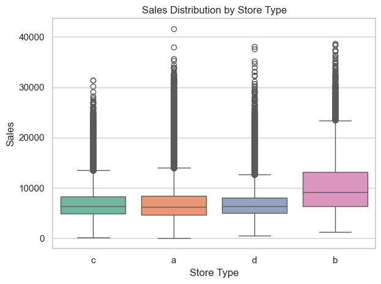

# Final Report
A leakage‑safe, time‑aware pipeline that forecasts daily sales per store.

---

## Executive Summary

- **Model:** XGBoost tuned with Optuna on a chronological split.
- **Test results (log scale):** **RMSE 0.169**, **MAE 0.130**, **R² 0.833**.
- **Data coverage:** 2013‑01‑01 to 2015‑07‑31; **844,338** open‑store rows; **1,115** stores.
- **Main drivers:** Promotions, competition distance, weekday and store effects.

> 

---

## 1. Problem & Approach

- Business need: reliable daily forecasts for staffing and inventory at the store level.
- Predict **log1p(Sales)** per store to stabilize variance.
- Use a **time‑aware split** with the last six weeks as test to mirror real deployment and prevent leakage.

---

## 2. Data & Features

- Built from `train.csv` joined with `store.csv`. Keep **open days only**. Remove `Customers` at training and inference time.
- Key transforms: `log1p(Sales)`, `log1p(CompetitionDistance)`, one‑hot for low‑cardinality categoricals, calendar parts (year, month, week, weekday, weekend).
- Useful engineered signals: a leakage‑safe **Store_AvgSales** (computed only on the training window), a small set of promo × store/assortment interactions, and **ActiveStoreCount** for daily coverage.

> 

---

## 3. Key EDA Findings

- **Promotions work.** Promo days shift the sales distribution higher and lift means.
- **Promo2 underperforms.** Stores flagged with Promo2 trail non‑Promo2 stores on average.
- **Competition proximity often helps.** Shorter distances correlate with higher sales, consistent with dense retail zones.
- **Store heterogeneity matters.** Type **b** stores are high‑performing but more volatile; others are steadier.
- **School holidays** show a measurable effect; **state holidays** mostly imply closures and were dropped.

> 
> 
> 
> 

---

## 4. Validation & Modeling

- **Split:** final six weeks (2015‑06‑19 → 2015‑07‑31) as test; earlier period for train/validation; no date overlap.
- Retrained on train+val and evaluated once on the holdout.
- **Result:** **RMSE 0.169**, **MAE 0.130**, **R² 0.833** on the log scale.

> 
> 

---

## 5. What Drives the Forecast

- **Promotions** are the strongest, most consistent signal across importance, permutation, and SHAP.
- **Competition distance** ranks among the top drivers; closer stores often see higher predicted sales.
- **Calendar/store effects** (weekday and store baselines) provide steady lift.

> 
> 
> 

---

## 6. Implications

- **Promo planning:** plan staffing and inventory around proven promo uplift; measure by store and weekday. Treat **Promo2** cautiously.
- **Operations:** accuracy is strong enough for schedule and inventory planning; add a buffer for peak days.
- **Location signal:** near‑competitor stores can thrive; proximity often proxies for foot traffic.

---

## 7. Next Steps

1. **Add prediction intervals** so planners see a range, not just a point.
2. **Automate a nightly batch run** that writes store‑day forecasts to CSV for the dashboard.
3. **Set a simple retraining cadence** (for example, quarterly) and monitor a few basic checks like promo mix and competition distance.
4. **Create a lightweight dashboard** to compare forecasts vs. actuals by store and day.

---

**Justin Castillo**  
Email: *[add your email]*  
GitHub: https://github.com/justin-castillo  
LinkedIn: https://www.linkedin.com/in/justin-castillo-69351198/
