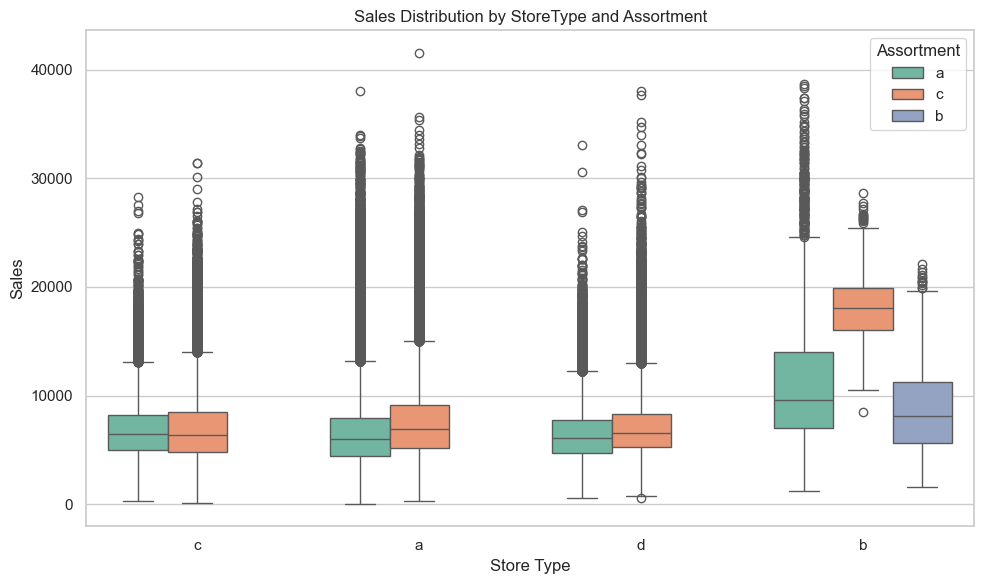

# Rossmann Store Sales Forecasting

This project delivers a full-cycle machine learning workflow to forecast daily sales across Rossmann retail stores. The pipeline includes structured EDA, engineered feature enrichment, gradient-boosting regression, hyperparameter tuning, and interpretability through SHAP analysis. The workflow reflects best practices for applied machine learning in a business context.

---

## Project Objective

To predict daily sales for individual Rossmann stores using historical, store-level, and promotional data, enabling better planning for inventory, staffing, and supply chain operations.

---

## Business Context

Rossmann is a major drugstore chain with over 3,000 locations across Europe. Predicting store-level sales is vital for optimizing operations and minimizing waste. This project simulates a real-world decision support system for retail forecasting using machine learning.

---

## Dataset Overview

The dataset includes:

- **Sales & Transactions**: Daily revenue per store and customer count.
- **Store Metadata**: Store type, assortment strategy, competition presence.
- **Date Features**: Weekdays, public holidays, school holidays, promo windows.
- **Temporal Coverage**: January 2013 to July 2015 (~844,000 records).

---

## Workflow Summary

### 1. Exploratory Data Analysis (EDA)
- Validated schema, nulls, and outliers.
- Explored distributions, sales trends, store patterns.
- Visualized impact of promotions, assortment, competition, and holidays.

>  
> 
> 

---

### 2. Feature Engineering
- Extracted temporal features: year, month, week, day, weekend.
- Built composite and ratio features: promo intensity, store-competition proximity.
- Created binary flags: school holidays, promo-mismatch anomalies.
- One-hot encoded high-impact categoricals.

> 

---

### 3. Modeling
- Selected **XGBoost Regressor** (primary) and **CatBoost** (as a check).
- Tuned hyperparameters using **Optuna** with Stratified K-Fold Cross-Validation.
- Standardized training/validation/test split to simulate real-world rollout.
- Logged performance across tuning iterations and final model fit.

---

### 4. Explainability
- Applied **SHAP** to quantify feature impact.
- Identified global feature importance and local deviations.
- Validated model behavior against business logic (e.g., weekend dips, promo peaks).

> 
> 🧠 *Visual Placeholder 6: SHAP Force Plot for Selected Store-Day*  
> 🧠 *Visual Placeholder 7: SHAP Dependence Plot – Promo vs Sales Impact*

---

## Key Results

| Metric         | Validation Set | Test Set |
|----------------|----------------|----------|
| RMSE (Root Mean Squared Error) | 0.42           | 0.41     |
| MAE (Mean Absolute Error)      | 0.32           | 0.32     |
| R² (Coefficient of Determination) | -0.0073        | -0.0019  |

- The model captured major trends but showed some underfitting on unseen data (R² < 0), likely due to store-level variability and factors not present in the dataset.
- SHAP analysis confirmed reliance on expected drivers such as promotions, day-of-week, and competition distance.

---

## Tools & Stack

| Category            | Tools / Libraries                      |
|---------------------|----------------------------------------|
| Programming         | Python (3.10+)                         |
| Data Manipulation   | pandas, numpy                          |
| Visualization       | seaborn, matplotlib                    |
| Modeling            | XGBoost, CatBoost, scikit-learn        |
| Tuning              | Optuna                                 |
| Explainability      | SHAP                                   |
| Environment         | Jupyter Notebooks, Conda               |

---

## Directory Structure

project_root/
│
├── data/ # Raw and processed datasets
├── notebooks/
│ ├── 01_EDA.ipynb # Exploratory Data Analysis
│ └── 02_Modeling.ipynb # Feature Engineering and Modeling
├── outputs/ # Evaluation plots, SHAP values, etc.
├── README.md # Overview and structure
└── FINAL_REPORT.md # Full narrative interpretation

---

## Next Steps

- Deploy model into a real-time or batch inference system.
- Implement retraining logic to incorporate new data.
- Explore ensemble methods or time series modeling (e.g., LightGBM with time lags).
- Package workflow as a reproducible pipeline using `sklearn.pipeline` or `MLflow`.

---

## Author

**Your Name**  
[LinkedIn](https://www.linkedin.com/in/your-linkedin-handle)  
[Portfolio (GitHub)](https://github.com/your-github-username)
